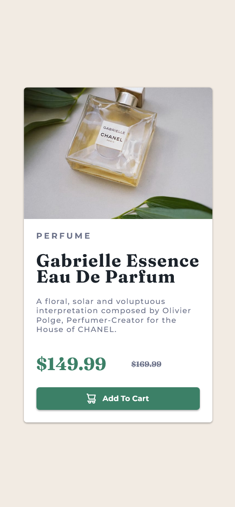

# Live Site URL: [https://chanel-widget.netlify.app/](https://chanel-widget.netlify.app/)

## Frontend Mentor - Product preview card component solution

This is a solution to the [Product preview card component challenge on Frontend Mentor](https://www.frontendmentor.io/challenges/product-preview-card-component-GO7UmttRfa). Frontend Mentor challenges help you improve your coding skills by building realistic projects.

## Table of contents

- [Live Site URL: https://chanel-widget.netlify.app/](#live-site-url-httpschanel-widgetnetlifyapp)
  - [Frontend Mentor - Product preview card component solution](#frontend-mentor---product-preview-card-component-solution)
  - [Table of contents](#table-of-contents)
  - [Overview](#overview)
    - [The challenge](#the-challenge)
    - [Screenshot - Mobile](#screenshot---mobile)
    - [Screenhot - Desktop](#screenhot---desktop)
    - [Links](#links)
  - [My process](#my-process)
    - [Built with](#built-with)
    - [What I learned](#what-i-learned)
    - [Continued development](#continued-development)
  - [Author](#author)

## Overview

### The challenge

Users should be able to:

- View the optimal layout depending on their device's screen size
- See hover and focus states for interactive elements

### Screenshot - Mobile



### Screenhot - Desktop


### Links

- Solution URL: [https://github.com/veeru-neerukonda/Product-preview-card-component.git](https://github.com/veeru-neerukonda/Product-preview-card-component.git)
- Live Site URL: [https://chanel-widget.netlify.app/](https://chanel-widget.netlify.app/)

## My process

### Built with

- Semantic HTML5 markup
- SCSS
- Flexbox
- Parcel
- Mobile-first workflow

### What I learned

Used Parcel for the first time when working on this project. It looks more like a liabality than an asset for now, although this may mean that I am not good at using it yet. learnt the importance of constants in this project. keeping stuff variable is important, but there has to be a standrad..

I am really proud of this code for the first time in a project -

```css
.product{
    width: 30rem;
    @include for-desktop-up{
        width: 60rem;
    }
}
```

### Continued development

I plan on studying parcel more in the future. My speed and competency styling components in realtime is not upto snuff.. I plan on working on estimation of time for my projects. Finally something like tailwind.css might help me achieve the speed and reliability that I want.

## Author

- Website - [Sriveer Neerukonda](https://veeru-portfolio.netlify.app/)
- Frontend Mentor - [@veeru-neerukonda](https://www.frontendmentor.io/profile/veeru-neerukonda)
- Twitter - [@empyrean__sama](https://twitter.com/empyrean__sama)
